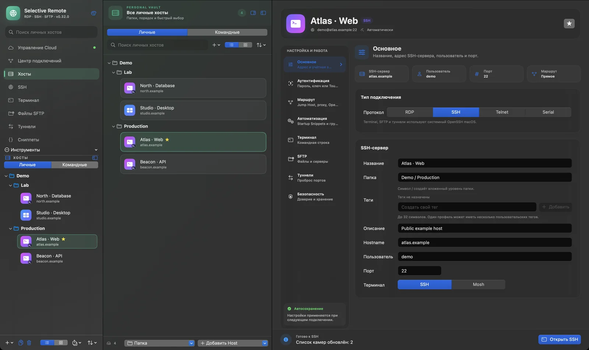
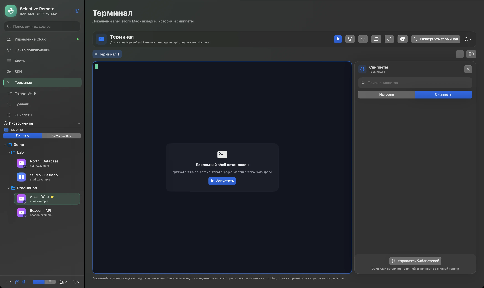
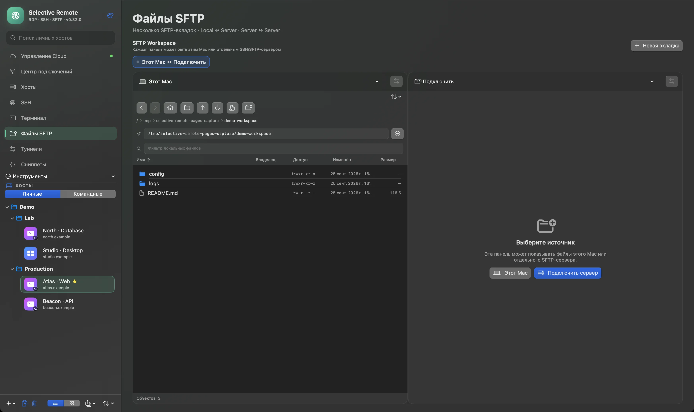
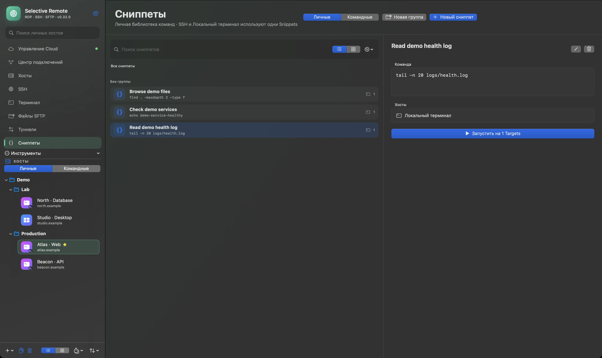

# Selective Remote

### Your infrastructure. One workspace.

**Русский** · [English](README_EN.md)

Нативное приложение для Mac, в котором подключения, файлы и команды находятся рядом. Работайте с SSH, RDP, SFTP и туннелями, не теряя контекст между инструментами.

**Текущий релиз: v0.31.0 (162)** · macOS 14+ · Apple Silicon · бесплатно, открытый код

**[Скачать v0.31.0](https://github.com/PastFly/Selective-Remote/releases/tag/v0.31.0)** · [Сайт](https://pastfly.github.io/Selective-Remote/ru/) · [Cloud](https://cloud.pastfly.ru/) · [Руководства](https://pastfly.github.io/Selective-Remote/ru/#guides)

> На всех снимках ниже — реальное приложение **0.32.0 (163) candidate** с вымышленными демоданными. Этот интерфейс ещё не выпущен; доступный для скачивания релиз — **v0.31.0 (162)**.

## Подключайтесь. Организуйте. Работайте.

- **Подключайтесь:** SSH и RDP на выбранных мониторах Mac; Telnet и Serial для нужных сценариев.
- **Организуйте:** профили, группы, избранное и теги держат инфраструктуру в порядке.
- **Работайте:** терминал, двухпанельный SFTP, SSH-туннели и Snippets доступны из одного приложения.

Сейчас в **v0.31.0** доступны SSH Workspace, локальный Terminal, SFTP, Forwarding Manager, Connection Center, диагностика, macOS Keychain и зашифрованные локальные резервные копии. [Подробно о возможностях и быстром старте](docs/FEATURES-RU.md).

### RDP на двух и более мониторах

В RDP-профиле можно выбрать, на каких дисплеях Mac показывать удалённый рабочий стол: на одном, двух или нескольких. Назначьте основной монитор Windows и расположите виртуальные экраны автоматически или вручную. Выбор сохраняется в профиле. [Руководство по RDP на нескольких мониторах](https://pastfly.github.io/Selective-Remote/guides/multi-monitor-rdp-macos.html).

### Терминал и команды

Вкладки и панели помогают держать рядом несколько сеансов; Snippets сохраняют повторяемые команды. На демоснимке локальный shell намеренно остановлен.

### Файлы между Mac и серверами

Двухпанельный SFTP поддерживает Mac ↔ Server и Server ↔ Server. На демоснимке видны только тестовые локальные файлы; сервер не подключён.

### Snippets для повторяемой работы

Библиотека команд общая для SSH и локального терминала. На снимке — три демонстрационные команды.

## Скоро в 0.32

Интеграция Mac ↔ Cloud, **Personal Vault** и **Team Vaults** запланированы для 0.32. Личный Vault предназначен для синхронизации Hosts, Credentials и Snippets, зашифрованных на устройстве, между доверенными Mac и браузерами. Командные Vaults добавляют общие данные, роли и приглашения. Это возможности будущего релиза, а не часть текущей загрузки v0.31.0. Локальная работа без аккаунта остаётся доступной.

[Архитектура Cloud и модель доверия](docs/cloud-v0.32-architecture.md) · [Открыть Cloud](https://cloud.pastfly.ru/)

## Безопасность и открытый код

SSH-секреты хранятся в macOS Keychain; новые SSH host keys не принимаются автоматически. Профили не экспортируют сохранённые пароли, а полные резервные копии шифруются. Исходный код открыт под [лицензией MIT](LICENSE). [Детали безопасности](docs/FEATURES-RU.md#безопасность) · [Сообщить об уязвимости](SECURITY.md).

## Установка

1. Скачайте DMG из [релиза v0.31.0](https://github.com/PastFly/Selective-Remote/releases/tag/v0.31.0).
2. Откройте образ и перетащите **Selective Remote** в «Программы».
3. Запустите приложение. Если macOS запросит подтверждение для community-сборки без Developer ID, разрешите запуск через «Системные настройки → Конфиденциальность и безопасность» или контекстное меню Finder.

Готовый DMG предназначен для **Apple Silicon** и **macOS 14 или новее**. Доступ к нужным серверам и разрешения для перенаправляемых устройств зависят от выбранного сценария.

Для разработки: `swift test`, `swift build -c release`, затем при необходимости `bash scripts/build_and_install.sh`. [Инструкция по сборке](BUILD-RU.md) · [Публикация](docs/PUBLISHING-RU.md) · [Подготовка релиза](docs/RELEASING-RU.md).

## Руководства

- [RDP на нескольких мониторах macOS](https://pastfly.github.io/Selective-Remote/guides/multi-monitor-rdp-macos.html)
- [SFTP между серверами на Mac](https://pastfly.github.io/Selective-Remote/guides/server-to-server-sftp-macos.html)
- [Возможности и быстрый старт](docs/FEATURES-RU.md)
- [История изменений](CHANGELOG.md)

## Связь и поддержка

[Сайт](https://pastfly.github.io/Selective-Remote/ru/) · [GitHub](https://github.com/PastFly/Selective-Remote) · [Telegram](https://t.me/SelectiveRemoteApp) · [Поддержать проект](SUPPORT.md) · [English](README_EN.md)

Поддержка добровольна и не открывает дополнительных функций. Новости о релизах публикуются в [Telegram](https://t.me/SelectiveRemoteApp).
