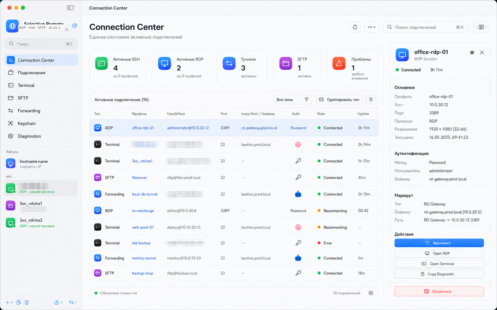
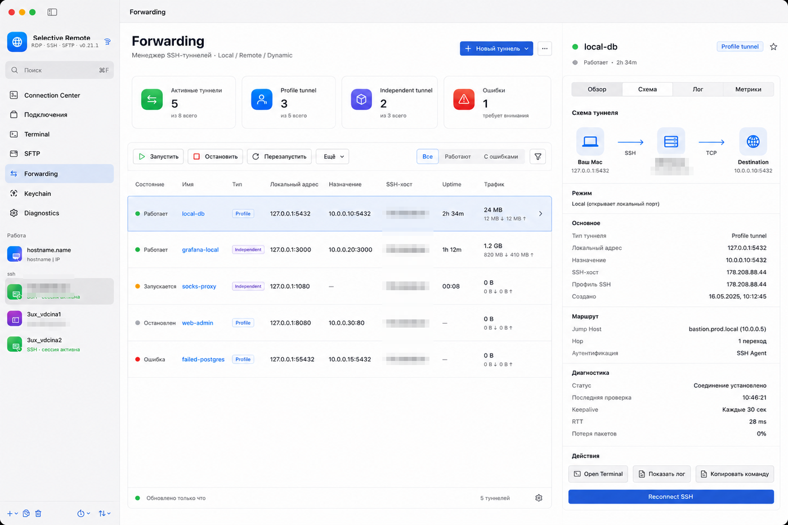

# Selective Remote

[English](README_EN.md) · **Русский**

[](https://github.com/PastFly/Selective-Remote/actions/workflows/ci.yml)
[](https://support.apple.com/macos)
[](LICENSE)

**Selective Remote** — нативный клиент удалённого доступа для macOS, который объединяет RDP, SSH-терминал, двухпанельный SFTP, SSH Forwarding и управление SSH credentials в одном приложении.

Проект ориентирован на Apple Silicon и macOS 14+. Интерфейс доступен на русском и английском языках.

<!-- SELECTIVE_REMOTE_0_21_3_BEGIN -->
## Что нового в 0.21.3

**0.21.3** — небольшой стабилизационный релиз после 0.21.2.

- Forwarding Manager: одиночный клик снова стабильно выделяет туннель, двойной клик по остановленному туннелю по-прежнему запускает его;
- Terminal Grid: устранён focus-loop, из-за которого «История и подсказки» могла бесконечно переключаться между двумя подключёнными panes;
- сохранены контекстные действия Forwarding и предыдущие UX-исправления ветки 0.21.x.
<!-- SELECTIVE_REMOTE_0_21_3_END -->

<!-- SELECTIVE_REMOTE_0_21_2_BEGIN -->
## Что нового в 0.21.2

**0.21.2** — стабилизационный UX-релиз поверх большого обновления Connection Center / Forwarding / Terminal из ветки 0.21.x.

- Connection Center: сортировка по столбцам и действия по правой кнопке мыши;
- Forwarding Manager: снова работает запуск остановленного туннеля двойным кликом, добавлено контекстное меню;
- Terminal: ручное отключение больше не считается ошибкой `Exit code 255`;
- Terminal Grid: исправлено «метание» панели истории/подсказок между panes, добавлена большая кнопка `+` в свободной ячейке;
- повторное подключение существующей Terminal pane выполняется к тому же серверу без лишнего выбора профиля;
- Server Commands: фильтр активных/неактивных служб, активные службы выше в списке и аккуратно выровненный поиск;
- исправлено обрезание подписей summary-карточек.

Визуальные примеры Connection Center и Forwarding Manager находятся ниже в README.
<!-- SELECTIVE_REMOTE_0_21_2_END -->

<!-- SELECTIVE_REMOTE_0_21_1_BEGIN -->
## Что нового в 0.21.1

**0.21.1** — крупное обновление runtime-интерфейса Selective Remote. Основные подключения теперь можно наблюдать и обслуживать как единое рабочее пространство, не создавая параллельных SSH/RDP session managers.

### Connection Center

Connection Center собирает **реальное состояние** активных RDP, Terminal, SFTP и SSH Forwarding-сессий: тип подключения, профиль, host/port, Jump Host или RDP Gateway, способ аутентификации, состояние, uptime и доступные действия. Для RDP используется состояние фактического SDL-FreeRDP process/session, а не просто наличие профиля.



### Forwarding Manager 2.0

Глобальный Forwarding объединяет Profile и Independent tunnels в одном менеджере, сохраняя их раздельные ownership, persistence и runtime state. Inspector показывает параметры и маршрут, а схема меняется для Local, Remote и Dynamic/SOCKS и отображает Jump Host/proxy только когда они действительно участвуют в соединении.



### Terminal, восстановление и диагностика

- **Terminal Workspace 2.0** — более заметные active tab/pane, состояния и uptime, быстрый reconnect и duplicate-with-connect, усиленный Broadcast Input;
- **Smart Reconnect** — ограниченные попытки с backoff после временных сетевых сбоев без бесконечных reconnect loops;
- **Server Commands 2.0** — discovery реального Linux-сервера и контекстные команды для systemd, журналов, сети, дисков и Docker/Podman через существующую Terminal/SSH-сессию;
- **Quick Connect 2.0** — `user@host`, нестандартный порт, выбор auth mode, SSH ID, Touch ID Key, ssh-agent, Jump Host, recent targets и Save as Profile;
- **Diagnostics Center 2.0** — безопасные Copy/Export Diagnostic для RDP/Terminal/SFTP/Forwarding без password, passphrase, Keychain и proxy secrets.

> В визуальных превью выше адреса внешних серверов анонимизированы.
<!-- SELECTIVE_REMOTE_0_21_1_END -->


## Что умеет Selective Remote

### RDP

- SDL-FreeRDP с полноэкранным и оконным режимом;
- работа с несколькими мониторами и Retina;
- перенаправление буфера обмена, звука, микрофона, камеры, принтеров и папок;
- настройки качества соединения;
- macOS-ориентированная раскладка клавиш: Command, Option и Fn;
- импорт `.rdp`, журнал запуска и встроенная диагностика;
- параллельные RDP-сессии для разных профилей.

### SSH-терминал

- встроенный терминал на системном `/usr/bin/ssh`;
- до восьми вкладок, каждая может подключаться к своему серверу;
- одна, две или четыре панели одновременно;
- независимые SSH-сессии и сохранение структуры рабочего пространства;
- локальная история команд, избранное и шаблоны;
- поиск и автоподсказки по каталогу из 300+ команд;
- подсказки для SSH, `authorized_keys`, systemd, Docker, Kubernetes, сети и диагностики;
- групповой ввод в несколько активных терминалов с явным предупреждением;
- закрепление и цветовые метки вкладок, duplicate/reconnect и Drag & Drop сортировка;
- палитра действий терминала через `⇧⌘K` и глобальный **Quick Connect** через `⌘K`;
- 14 тем, выбор шрифта, размера, курсора и прозрачности окна.

### SSH credentials и Touch ID

В SSH-профиле можно явно выбрать способ входа:

- **Автоматически**;
- **Пароль**;
- **SSH-ключ**;
- **Touch ID Key**;
- **ssh-agent / `~/.ssh/config`**.

SSH-пароли сохраняются только в **macOS Keychain** и не экспортируются вместе с профилями. Для сохранённого пароля можно включить обязательное подтверждение Touch ID перед использованием.

Selective Remote умеет создавать SSH-ключи, импортировать существующие и безопасно добавлять публичный ключ в `~/.ssh/authorized_keys` сервера без перезаписи уже существующих ключей. Глобальный **Keychain** показывает SSH ID, Touch ID Key, сохранённые passwords, OpenSSH certificates, Certificate Authorities и `known_hosts`.

Для OpenSSH certificates приложение умеет читать `*-cert.pub`, показывать principals/serial/срок действия и использовать `CertificateFile`. SSH CA public keys можно зарегистрировать в Keychain; если private CA key находится рядом с public key, Selective Remote может выпустить стандартный OpenSSH certificate через системный `ssh-keygen`. Private CA key остаётся обычным файлом и не копируется в Keychain.

Раздел **Known Hosts** читает `~/.ssh/known_hosts`, показывает SHA256 fingerprint и предупреждает, если текущий host key отличается от сохранённого. Новый host key не принимается автоматически.

**Touch ID Key** — отдельный режим, в котором Selective Remote требует Touch ID перед использованием выбранного приватного ключа. В текущей community-реализации приватный ключ остаётся обычным OpenSSH-файлом в `~/.ssh`; это не Secure Enclave key.

### SFTP

Самостоятельный двухпанельный файловый менеджер:

- локальная панель Mac и удалённая панель сервера;
- сохранённый SSH-профиль или временный сервер;
- persistent SSH master, чтобы пароль не спрашивался на каждую операцию;
- загрузка и скачивание файлов и каталогов;
- Drag & Drop между Finder и SFTP;
- множественное выделение с `⌘` и `Shift`;
- рекурсивное удаление папок;
- создание папок, переименование, свойства и POSIX-права;
- просмотр размеров файлов и каталогов;
- прогресс больших передач с объёмом и скоростью;
- периодическое автоматическое обновление удалённой панели;
- подсказки путей и навигация по истории;
- встроенное редактирование удалённых UTF-8-файлов.

### SSH Forwarding

Отдельный раздел для туннелей, не привязанный к текущей карточке подключения. Список туннелей и Inspector разделены, активный маршрут визуально подсвечивается, двойной клик запускает туннель, а правый клик открывает быстрые действия:

- Local forwarding;
- Remote forwarding;
- SOCKS5;
- использование сохранённого SSH-профиля или ручного SSH-адреса;
- парольная аутентификация через Keychain/AskPass;
- SSH-ключи и ssh-agent;
- keepalive и контроль ошибки открытия порта.

### SSH Config, Quick Connect и Jump Host

Selective Remote продолжает передавать alias из `~/.ssh/config` системному OpenSSH, поэтому работают штатные `Host`, `Include`, `IdentityFile` и другие параметры конфигурации. Quick Connect также показывает конкретные `Host` из `~/.ssh/config` и позволяет импортировать их как профили без копирования секретов.

Для bastion-сценариев SSH-профиль может использовать другой сохранённый SSH-профиль как **Jump Host / ProxyJump**. Подключение строится через системный `ssh -J`, а в карточке профиля отображается маршрут `Mac → Jump Host → Target`.

### Proxy

SSH-профиль может использовать:

- прямое подключение;
- **HTTP CONNECT proxy**;
- **SOCKS5 proxy**.

Настройка применяется к Terminal, SFTP и Forwarding. HTTP CONNECT и SOCKS5 поддерживают username/password-аутентификацию. Пароль прокси хранится в macOS Keychain и передаётся отдельному helper-процессу через краткоживущий файл с правами `0600`, поэтому секрет не попадает в аргументы OpenSSH. В карточке SSH есть встроенная диагностика TCP, proxy и выбранного способа аутентификации.

## Установка

Скачайте DMG из [последнего GitHub Release](https://github.com/PastFly/Selective-Remote/releases/latest), откройте образ и перетащите **Selective Remote** в `Applications`.

В community-релизах без Developer ID используется ad-hoc подпись. На новом Mac может потребоваться один раз разрешить запуск через **Системные настройки → Конфиденциальность и безопасность → Всё равно открыть** либо открыть приложение через контекстное меню Finder.

Для полностью штатного запуска без такого подтверждения необходимы Developer ID Application и notarization Apple.

## Навигация и контекстные действия

- правый клик по SSH/RDP-профилю: подключение, Terminal/SFTP/Forwarding, избранное, копия и удаление;
- правый клик по терминальной вкладке: reconnect, pin, цвет, duplicate и изменение подключения;
- правый клик в Keychain: операции с ключом, ssh-agent и credential;
- правый клик по туннелю: запуск, остановка, перезапуск, журнал, копия и удаление;
- **⌘K** открывает Quick Connect для поиска профиля/hostname и Hosts из `~/.ssh/config`.

В меню **Справка** доступна встроенная краткая справка по основным разделам приложения.

## Быстрый старт SSH

1. Создайте SSH-профиль и укажите hostname/IP, пользователя и SSH-порт.
2. Выберите способ входа.
3. Для режима **Пароль** сохраните пароль в Keychain и при необходимости включите Touch ID.
4. Для режима **SSH-ключ** выберите существующий ключ или создайте новый.
5. Для **Touch ID Key** создайте отдельный ключ и установите его публичную часть на сервер.
6. Нажмите **Открыть SSH**.

Terminal, SFTP и Forwarding используют настройки аутентификации выбранного SSH-профиля.

## Сборка из исходников

Требования: macOS 14+, Xcode Command Line Tools и Homebrew.

```bash
brew install freerdp sdl3
git clone https://github.com/PastFly/Selective-Remote.git
cd Selective-Remote
./scripts/build_and_install.sh
```

Для разработки:

```bash
swift test
swift run SelectiveRemote
```

Сборка приложения и DMG:

```bash
./scripts/build_app.sh
```

Подробности находятся в [BUILD-RU.md](BUILD-RU.md) и [docs/RELEASING-RU.md](docs/RELEASING-RU.md).

## Конфиденциальность

- пароли SSH хранятся в macOS Keychain;
- приватные SSH-ключи остаются файлами под контролем пользователя;
- экспорт профилей не содержит паролей и приватных ключей;
- история терминала хранится локально, а строки с распространёнными признаками секретов автоматически не сохраняются;
- доступ к камере, микрофону и папкам запрашивается только для соответствующих функций RDP.

Подробнее: [PRIVACY.md](PRIVACY.md) и [SECURITY.md](SECURITY.md).

## Обновления

Приложение использует `Resources/updates.json` и может проверять новый GitHub-релиз. История изменений ведётся в [CHANGELOG.md](CHANGELOG.md).

## Статус проекта

Selective Remote активно развивается. Если вы нашли ошибку, приложите версию приложения, шаги воспроизведения и журнал соответствующей сессии.

## Лицензия

Selective Remote распространяется по лицензии [MIT](LICENSE). FreeRDP, SDL, xterm.js и другие компоненты сохраняют собственные лицензии — см. [THIRD-PARTY-NOTICES](Resources/THIRD-PARTY-NOTICES.txt).
