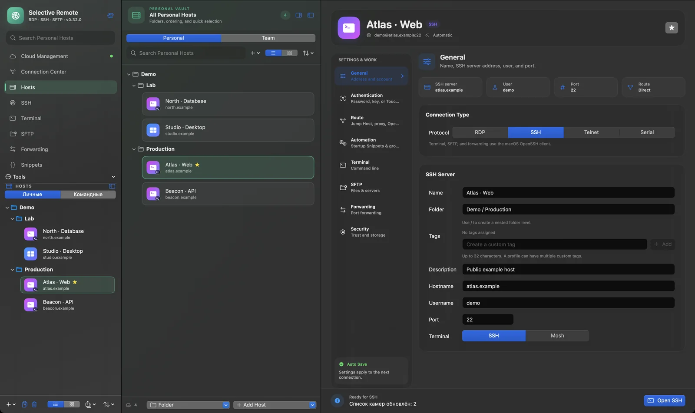
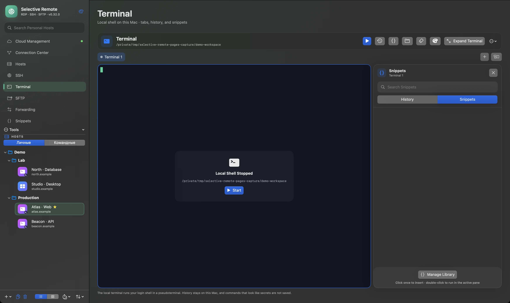
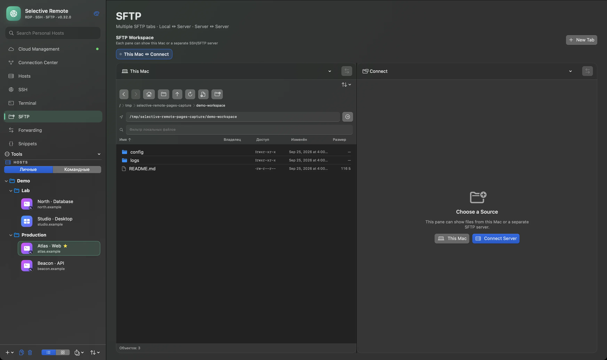
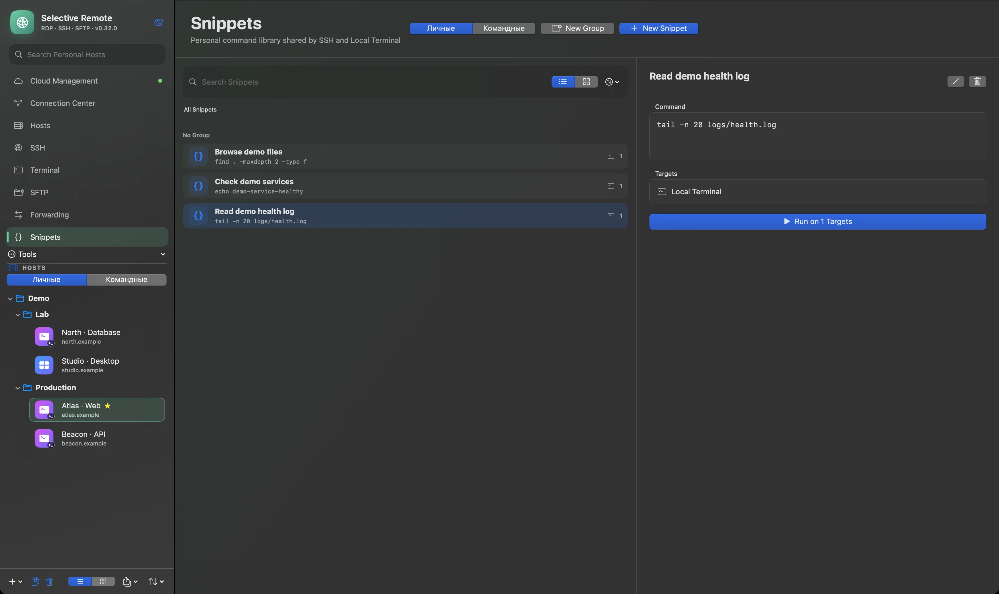

# Selective Remote

### Your infrastructure. One workspace.

[Русский](README.md) · **English**

A native Mac app that keeps connections, files, and commands together. Work across SSH, RDP, SFTP, and tunnels without losing context between tools.

**Current release: v0.31.0 (162)** · macOS 14+ · Apple Silicon · free and open source

**[Download v0.31.0](https://github.com/PastFly/Selective-Remote/releases/tag/v0.31.0)** · [Website](https://pastfly.github.io/Selective-Remote/) · [Cloud](https://cloud.pastfly.ru/) · [Guides](https://pastfly.github.io/Selective-Remote/#guides)

> Every image below is a real capture of the **0.32.0 (163) candidate** with synthetic demo data. This interface has not been released; the available download is **v0.31.0 (162)**.

## Connect. Organize. Work.

- **Connect:** SSH and RDP, including multiple displays; Telnet and Serial when needed.
- **Organize:** profiles, groups, favorites, and tags keep infrastructure easy to find.
- **Work:** Terminal, dual-pane SFTP, SSH tunnels, and Snippets stay in one app.

Available now in **v0.31.0**: SSH Workspace, local Terminal, SFTP, Forwarding Manager, Connection Center, diagnostics, macOS Keychain, and encrypted local backups. [Explore the features and quick start](docs/FEATURES-EN.md).

### Terminal and commands

Tabs and panes keep sessions close; Snippets store reusable commands. The local demo shell in this capture is intentionally stopped.

### Files across Mac and servers

Dual-pane SFTP supports Mac ↔ Server and Server ↔ Server transfers. The capture shows only local test files; no server is connected.

### Snippets for repeatable work

The command library is shared by SSH and the local terminal. The capture contains three synthetic demo commands.

## Coming in 0.32

Mac ↔ Cloud integration, **Personal Vault**, and **Team Vaults** are planned for 0.32. Personal Vault is designed to synchronize client-encrypted Hosts, Credentials, and Snippets across trusted Mac and browser devices. Team Vaults add shared data, roles, and invitations. These are upcoming capabilities, not part of the current v0.31.0 download. Local work remains available without an account.

[Cloud architecture and trust model](docs/cloud-v0.32-architecture.md) · [Open Cloud](https://cloud.pastfly.ru/)

## Security and open source

SSH secrets are stored in macOS Keychain; new SSH host keys are not accepted automatically. Profiles do not export saved passwords, and full backups are encrypted. The source is available under the [MIT license](LICENSE). [Security details](docs/FEATURES-EN.md#security) · [Report a vulnerability](SECURITY.md).

## Installation

1. Download the DMG from [release v0.31.0](https://github.com/PastFly/Selective-Remote/releases/tag/v0.31.0).
2. Open the image and drag **Selective Remote** into Applications.
3. Launch the app. If macOS requests approval for a community build without Developer ID, allow it in **System Settings → Privacy & Security** or from Finder's context menu.

The ready-made DMG targets **Apple Silicon** and **macOS 14 or newer**. Server access and permissions for redirected devices depend on your workflow.

For development: `swift test`, `swift build -c release`, then optionally `bash scripts/build_and_install.sh`. [Build instructions](BUILD-RU.md) · [Publishing](docs/PUBLISHING-RU.md) · [Release preparation](docs/RELEASING-RU.md).

## Guides

- [Multi-monitor RDP on macOS](https://pastfly.github.io/Selective-Remote/guides/multi-monitor-rdp-macos.html)
- [Server-to-Server SFTP on Mac](https://pastfly.github.io/Selective-Remote/guides/server-to-server-sftp-macos.html)
- [Features and quick start](docs/FEATURES-EN.md)
- [Changelog](CHANGELOG_EN.md)

## Community and support

[Website](https://pastfly.github.io/Selective-Remote/) · [GitHub](https://github.com/PastFly/Selective-Remote) · [Telegram](https://t.me/SelectiveRemoteApp) · [Support the project](SUPPORT.md#english) · [Русский](README.md)

Support is optional and does not unlock features. Release news is shared on [Telegram](https://t.me/SelectiveRemoteApp).
