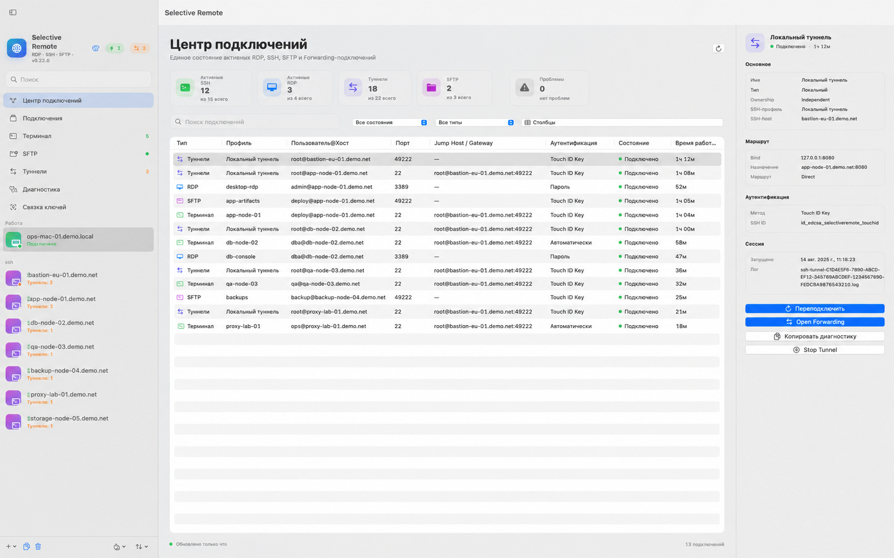
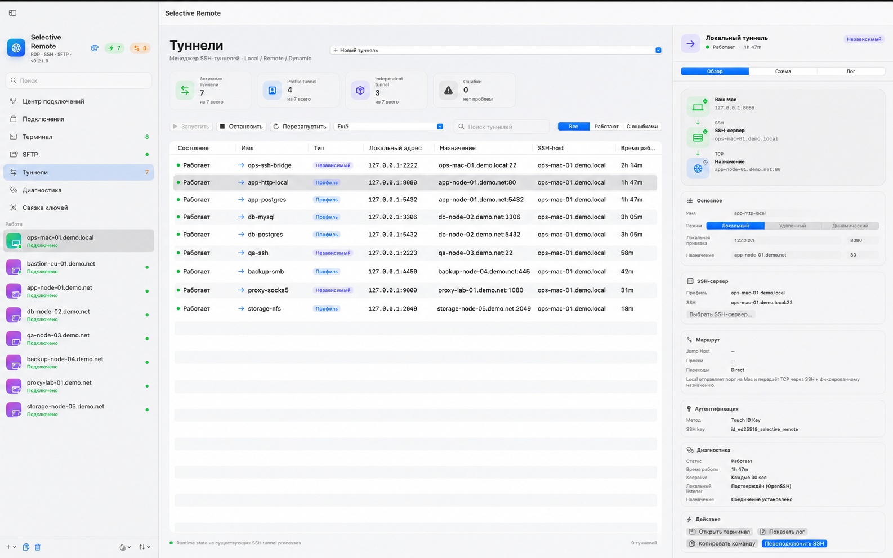

# Selective Remote

**English** · [Русский](README.md)

[](https://github.com/PastFly/Selective-Remote/actions/workflows/ci.yml)
[](https://support.apple.com/macos)
[](LICENSE)
[](SUPPORT.md#english)
[](https://pastfly.github.io/Selective-Remote/)

**Selective Remote** is a free, open-source RDP, SSH, and SFTP client for macOS. It combines multi-monitor RDP with Retina support, an SSH Workspace, a local terminal, a shared Snippets library, dual-pane SFTP with Server → Server transfers, SSH port forwarding, diagnostics, and SSH credential management in one app.

The project targets Apple Silicon and macOS 14+. The interface is available in English and Russian.

**Built for:** sysadmins, DevOps, homelabs, and anyone looking for an RDP client for macOS, SSH client for macOS, or SFTP client for macOS without switching between several apps.

[Download the latest release](https://github.com/PastFly/Selective-Remote/releases/latest) · [Project website](https://pastfly.github.io/Selective-Remote/) · [Русский README](README.md)

## Main workspaces

### Connection Center

**Connection Center** presents the real state of active RDP, SSH, local Terminal, SFTP, and Forwarding sessions in one place, including server, profile, authentication method, state, uptime, and available actions.



### RDP

- SDL-FreeRDP with windowed mode and true macOS fullscreen;
- Retina rendering without scaling the whole application window;
- multi-monitor RDP across Retina and external displays;
- manual monitor layout;
- correct Windows taskbar visibility in fullscreen;
- clipboard, audio, microphone, camera, printer, and folder redirection;
- RDP Gateway;
- Smart Reconnect after temporary network failures;
- macOS-oriented Command, Option, and Fn behavior;
- parallel RDP sessions for different profiles.

### SSH Workspace

The built-in SSH terminal uses the system `/usr/bin/ssh` and supports:

- independent tabs and split/grid panes;
- different servers in different tabs and panes;
- persistent workspace layout;
- command history, favorites, a built-in catalog, and suggestions;
- automatically detected Server Commands for Linux, systemd, network, disk, and container tasks;
- reconnect, duplicate, drag-and-drop ordering, and tab colors;
- Broadcast Input with an explicit warning;
- an action palette and quick SFTP handoff;
- configurable terminal themes, fonts, text size, and cursor.

In split/grid layouts, history, common commands, server commands, favorites, and Snippets share one full-size Inspector for the active pane.

### Local Terminal

The separate **Terminal** workspace launches the current user's system login shell without SSH:

- up to eight independent tabs;
- a separate working directory for every tab;
- quick folder selection and screen clearing;
- history, themes, and the shared Snippets library;
- the native `⌘T` shortcut for a new tab.

### Snippets

The global **Snippets** library is shared by SSH Workspace and Local Terminal:

- groups with back navigation and persisted folder selection;
- list and grid presentation modes;
- create, edit, duplicate, move, and delete commands;
- multiline commands and scripts without losing line breaks;
- assignment of one snippet to multiple SSH Targets;
- run on Targets, run in the current terminal, insert without running, and copy.

### SFTP

A standalone dual-pane file manager with:

- local Mac and remote server panes;
- saved SSH profiles or temporary servers;
- a persistent SSH master so a password is not requested for every operation;
- upload and download of files and directories;
- drag and drop between Finder and SFTP;
- multi-selection;
- recursive directory deletion;
- folder creation, rename, and POSIX permissions;
- large-transfer progress, transferred size, and speed;
- periodic remote refresh;
- path history and suggestions;
- editing of remote UTF-8 files.

### Forwarding Manager

The global SSH forwarding workspace combines profile tunnels and independent tunnels while keeping their settings and runtime state separate.

- Local forwarding;
- Remote forwarding;
- Dynamic / SOCKS5;
- saved SSH profiles or temporary SSH targets;
- Keychain/AskPass, SSH IDs, and ssh-agent;
- keepalive and port-open error diagnostics;
- an Inspector with parameters and a visual route diagram;
- quick start/stop/restart and context actions.



### Keychain

The global **Keychain** workspace brings together:

- SSH IDs;
- Touch ID Keys;
- saved SSH passwords;
- OpenSSH certificates;
- SSH Certificate Authorities;
- `~/.ssh/known_hosts`.

SSH passwords and passphrases are stored in macOS Keychain. Saved SSH passwords can optionally require Touch ID confirmation before use.

Selective Remote can create and import SSH keys, work with `ssh-agent`, install a public key without overwriting `authorized_keys`, inspect OpenSSH certificates, and verify saved host keys.

In the community implementation, **Touch ID Key** requires biometrics before the selected ECDSA key is used, but the private key itself remains a regular OpenSSH file; it is not a Secure Enclave key.

### Quick Connect, Jump Host, and Proxy

**Quick Connect** can open a saved profile, `user@host`, or a temporary SSH target and optionally save it as a profile.

For bastion scenarios, an SSH profile can use another saved profile as a **Jump Host / ProxyJump**. HTTP CONNECT and SOCKS5 proxies with authentication are also supported.

### Diagnostics Center

**Diagnostics Center** presents RDP, Terminal, SFTP, and Forwarding state, application environment information, and active problems. The diagnostic report can be copied or exported.

The report intentionally does not read passwords, passphrases, Keychain values, proxy secrets, or private-key contents. SSH key and certificate paths are reduced to a basename where needed for a safe report.

### Appearance, language, and updates

- system, light, and dark application themes;
- separate terminal themes;
- multiple text sizes and interface density options;
- English and Russian UI;
- a native **Settings** window for appearance and updates;
- built-in update checks;
- automatic checks and optional automatic update downloads;
- DMG download with SHA-256 verification;
- update installation only after explicit user confirmation.

## Security

Selective Remote prefers native macOS and OpenSSH mechanisms:

- SSH passwords and related secrets are stored in macOS Keychain;
- exported profiles do not contain saved passwords;
- new SSH host keys are not accepted automatically;
- proxy passwords are not passed in OpenSSH command-line arguments;
- Diagnostics Center redacts potential secrets before Copy/Export;
- private SSH keys remain user-owned files and are not copied into application profiles.

Verify trust in Jump Hosts, proxies, certificate authorities, and changed host keys before using them.

## System requirements

- macOS 14 or later;
- Apple Silicon for the prebuilt arm64 DMG releases;
- network access to the required RDP/SSH servers;
- macOS microphone, camera, and other device permissions are needed only when the corresponding redirection is enabled.

## Installation

1. Download the DMG from the [latest GitHub Release](https://github.com/PastFly/Selective-Remote/releases/latest).
2. Open the disk image.
3. Drag **Selective Remote** to `Applications`.
4. Launch the application.

Community releases without a Developer ID may use ad-hoc signing. In that case, macOS may require a one-time approval in **System Settings → Privacy & Security** or via Finder's context menu.

## Quick start

### RDP

1. Create an RDP profile.
2. Enter the computer, username, and optional RDP Gateway.
3. Choose windowed/fullscreen mode and displays.
4. Configure the required device redirection.
5. Click **Connect**.

### SSH

1. Create an SSH profile or open Quick Connect.
2. Enter the hostname/IP, username, and port.
3. Choose password, SSH ID, Touch ID Key, or the system `ssh-agent` / `~/.ssh/config`.
4. Configure a Jump Host or Proxy when needed.
5. Open Terminal, SFTP, or Forwarding.

### Local Terminal and Snippets

1. Open **Terminal** to launch a local login shell.
2. Use the folder button to select the active tab's working directory.
3. Open **Snippets**, create a group, and add a command or multiline script.
4. Run the snippet locally or assign it to one or more SSH Targets.

## Building from source

Basic project checks:

```bash
swift test
swift build -c release
```

Build and install the app locally:

```bash
bash scripts/build_and_install.sh
```

Additional documentation:

- [BUILD-RU.md](BUILD-RU.md)
- [Publishing](docs/PUBLISHING-RU.md)
- [Release preparation](docs/RELEASING-RU.md)

## Support the project

Selective Remote remains free and open source. If the application is useful to you, you can [support its continued development](SUPPORT.md#english). Support is entirely optional and does not unlock additional features.

## Changelog

Release-specific history lives in [CHANGELOG.md](CHANGELOG.md). The README describes the current product instead of duplicating release notes.

## License

The project is distributed under the [MIT License](LICENSE).
