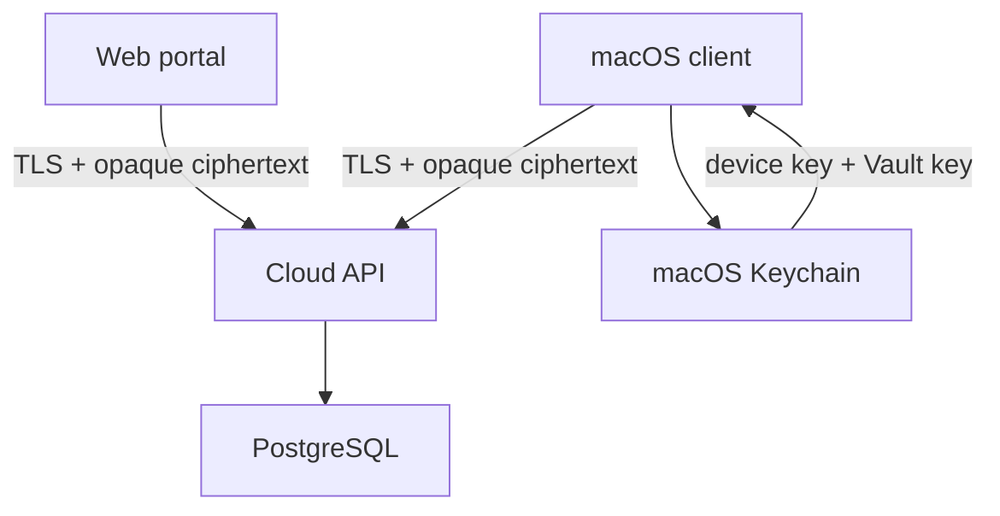

# Selective Remote Cloud v0.32

## Scope

Version 0.32 introduces optional self-hosted accounts, personal Vaults, Teams
and shared Team Vaults for Selective Remote. The macOS application remains
fully usable without an account. This foundation milestone implements account,
device and opaque personal-Vault storage only; shared Vault data structures,
membership, roles and key distribution are later milestones within the final
0.32 scope. FIDO2 remains outside the initial 0.32 release scope.

The first production deployment targets:

- Ubuntu 24.04;
- `cloud.pastfly.ru`;
- Docker Compose;
- Caddy-managed HTTPS;
- PostgreSQL for account metadata and encrypted Vault revisions.

## Trust boundary

The Cloud service authenticates users, tracks devices and stores encrypted
Vault revisions. It must never receive plaintext profiles, credentials,
private keys, snippets, logs or the user's Vault key.

Authentication and Vault encryption are separate:

1. Account authentication establishes who may access an encrypted Vault.
2. A random 256-bit Vault key encrypts the data locally with AES-256-GCM.
3. The Vault key is wrapped locally with a key derived from a recovery
   passphrase. The service stores only the wrapped key and KDF parameters.
4. Every device has its own identifier and locally stored secret material.
5. OAuth providers never become encryption keys and cannot decrypt a Vault.

PBKDF2-HMAC-SHA256 with a unique salt and at least 600,000 iterations is used
for the first cross-platform envelope because it is available in CryptoKit /
CommonCrypto and Web Crypto. The envelope is versioned so that Argon2id can be
introduced later without rewriting Vault payloads.

## Sync model

The personal Vault is an opaque, versioned document in v0.32:

- `vault_id` identifies the personal Vault;
- `revision` is a monotonically increasing server revision;
- `base_revision` makes writes conditional;
- `ciphertext`, `nonce` and `tag` are produced by the client;
- `content_hash` is the base64url SHA-256 of the encrypted envelope bytes, never
  a plaintext hash;
- conflicting writes return HTTP `409` and never silently overwrite data.

Envelope v1 uses unpadded base64url fields, a 12-byte AES-GCM nonce, a 16-byte
authentication tag and a 32-byte content hash. Every uploaded revision includes
the wrapped Vault key so a later write cannot accidentally erase recovery data.

### Envelope v1 interoperability profile

The browser implementation uses Web Crypto without Node-only dependencies:

- the Vault key is a random extractable 256-bit AES-GCM key;
- the recovery passphrase is normalized to Unicode NFC, encoded as UTF-8 and is
  never sent to the service;
- PBKDF2-HMAC-SHA256 uses a random 16-byte salt and exactly 600,000 iterations
  to derive a non-extractable 256-bit AES-KW key;
- `wrappedKey` contains only `algorithm=PBKDF2-SHA256+A256KW`,
  `iterations=600000`, the unpadded base64url salt and the 40-byte AES-KW
  wrapped Vault key;
- Vault JSON is encrypted with AES-256-GCM, a fresh 12-byte nonce, a 16-byte tag
  and UTF-8 additional authenticated data
  `selective-remote:vault-envelope:v1`;
- `contentHash` is unpadded base64url SHA-256 over
  `0x01 || nonce || ciphertext || authTag`, in that byte order.

Clients must reject changed KDF parameters, malformed lengths, content-hash
mismatches and AES-GCM authentication failures. The account password is not a
Vault or recovery key. PBKDF2 does not make a weak recovery passphrase safe;
the UI must require and confirm a strong independent recovery passphrase and
must not persist plaintext, the passphrase or raw Vault keys in web storage.

The decrypted Vault document uses `schemaVersion=1`, deterministically sorted
`records` and `tombstones`. Records have a stable UUID, one of the initial
types `host`, `credential`, `snippet` or `forwarding`, JSON-safe local
data, a canonical UTC `modifiedAt` value for display and a version vector
keyed by device UUID. Tombstones retain the stable UUID, deletion time and the
same version-vector format.

Every local edit or deletion increments the current device's vector entry.
During merge, a vector that causally dominates another wins. Equal vectors
must describe identical entities. Concurrent vectors, including concurrent
edit/delete operations, are omitted from the merge preview and returned as an
explicit conflict; no timestamp silently chooses a winner. Resolution joins
both vectors and increments the resolving device before the chosen record or
tombstone can be uploaded. Modification timestamps are informational and do
not establish causality, avoiding data loss from clock skew.

### Browser-local preview boundary

The initial personal Vault preview persists one strict local snapshot in
IndexedDB: a monotonically increasing local revision, a random device UUID and
the encrypted envelope. Record titles, addresses, usernames, secrets, snippets
and forwarding configuration remain inside the ciphertext. The revision and
random device UUID are local metadata and are not secret content.

The recovery passphrase and raw Vault key are never written by the
application. The raw key exists only in the live controller; explicit locking,
failed unlock and page teardown drop that reference. Every CRUD mutation is
normalized, encrypted with a fresh nonce and treated as committed only after
the IndexedDB transaction completes. Storage corruption, unknown snapshot
fields, revision mismatch, unavailable IndexedDB and wrong recovery phrases
fail closed. There is deliberately no plaintext or Web Storage fallback.

This preview is local-only. It does not authenticate, upload, download or claim
cross-device recovery. Cloud synchronization must later reconcile the local
encrypted revision against the authenticated server revision without making
IndexedDB a second source of truth.

The client downloads the latest revision, decrypts and validates it locally,
performs this record-level merge, resolves any conflicts locally, then uploads
a new encrypted revision based on the latest server revision. Tombstones
prevent another device from resurrecting a causally older deleted record.

The Cloud payload is separate from `.srbackup`. Backup archives remain manual,
portable rollback artifacts; Cloud revisions are small synchronization units.

Shared Vaults use independent random Vault keys. The final design must wrap a
shared key separately for authorized members/devices, enforce roles in both
the API and clients, and rotate the key (or use an equivalently reviewed
revocation design) when access is removed. The exact invitation, role and key
rotation protocol must be threat-modelled before those endpoints are added.

## API v1

| Method | Path | Purpose |
| --- | --- | --- |
| `GET` | `/healthz` | Process health |
| `GET` | `/readyz` | Database readiness |
| `GET` | `/v1/meta` | Supported API and Vault schema |
| `POST` | `/v1/auth/register` | Create an email account |
| `POST` | `/v1/auth/login` | Create an opaque session |
| `POST` | `/v1/auth/logout` | Revoke the current session |
| `GET` | `/v1/me` | Current account and device |
| `GET` | `/v1/devices` | List account devices |
| `DELETE` | `/v1/devices/{id}` | Revoke a device and its sessions |
| `GET` | `/v1/vault` | Download latest encrypted revision |
| `PUT` | `/v1/vault` | Conditionally upload a revision |

Google, Apple and Microsoft/Azure sign-in are represented as account identity
providers in the schema for future compatibility. OAuth redirect and callback
flows are not implemented by this foundation milestone and must not be exposed
as available until provider-specific implementation and security review pass.

## Deployment boundary

Only ports 80 and 443 are exposed publicly. PostgreSQL and the API container
remain on the internal Compose network. SSH administration stays on the host
and is not managed by this stack. Runtime secrets live in an untracked `.env`
file with restrictive permissions.

Before public deployment:

1. create an `A` record for `cloud.pastfly.ru` pointing to the server;
2. restrict inbound traffic to SSH, HTTP and HTTPS;
3. generate independent database and session-token secrets;
4. configure SMTP before allowing public email registration;
5. back up the PostgreSQL volume and test restoration;
6. run the API and migration test suites.
