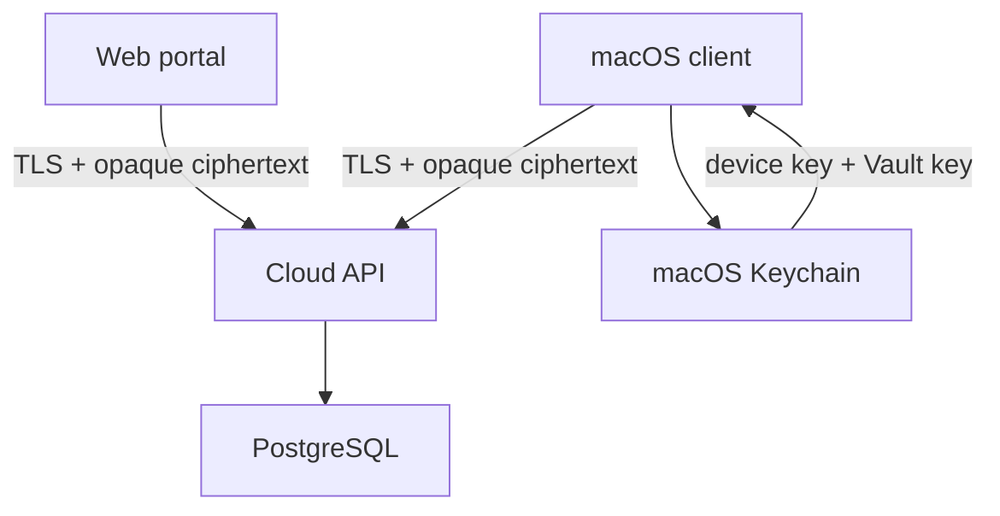

# Selective Remote Cloud v0.32

## Scope

Version 0.32 introduces optional self-hosted accounts, personal Vaults, Teams
and shared Team Vaults for Selective Remote. The macOS application remains
fully usable without an account. This foundation milestone implements account,
device and opaque personal-Vault storage only; shared Vault data structures,
membership, roles and key distribution are later milestones within the final
0.32 scope. FIDO2 remains outside the initial 0.32 release scope.

The first production deployment targets:

- Ubuntu 24.04;
- `cloud.pastfly.ru`;
- Docker Compose;
- Caddy-managed HTTPS;
- PostgreSQL for account metadata and encrypted Vault revisions.

## Trust boundary

The Cloud service authenticates users, tracks devices and stores encrypted
Vault revisions. It must never receive plaintext profiles, credentials,
private keys, snippets, logs or the user's Vault key.

Authentication and Vault encryption are separate:

1. Account authentication establishes who may access an encrypted Vault.
2. A random 256-bit Vault key encrypts the data locally with AES-256-GCM.
3. The Vault key is wrapped locally with a key derived from a recovery
   passphrase. The service stores only the wrapped key and KDF parameters.
4. Every device has its own identifier and locally stored secret material.
5. OAuth providers never become encryption keys and cannot decrypt a Vault.

PBKDF2-HMAC-SHA256 with a unique salt and at least 600,000 iterations is used
for the first cross-platform envelope because it is available in CryptoKit /
CommonCrypto and Web Crypto. The envelope is versioned so that Argon2id can be
introduced later without rewriting Vault payloads.

## Sync model

The personal Vault is an opaque, versioned document in v0.32:

- `vault_id` identifies the personal Vault;
- `revision` is a monotonically increasing server revision;
- `base_revision` makes writes conditional;
- `ciphertext`, `nonce` and `tag` are produced by the client;
- `content_hash` is the base64url SHA-256 of the encrypted envelope bytes, never
  a plaintext hash;
- conflicting writes return HTTP `409` and never silently overwrite data.

Envelope v1 uses unpadded base64url fields, a 12-byte AES-GCM nonce, a 16-byte
authentication tag and a 32-byte content hash. Every uploaded revision includes
the wrapped Vault key so a later write cannot accidentally erase recovery data.

The client downloads the latest revision, decrypts it locally, performs a
record-level merge by stable UUID and modification timestamp, then uploads a
new revision based on the latest server value. Deletions use tombstones so
that another device cannot resurrect removed records.

The Cloud payload is separate from `.srbackup`. Backup archives remain manual,
portable rollback artifacts; Cloud revisions are small synchronization units.

Shared Vaults use independent random Vault keys. The final design must wrap a
shared key separately for authorized members/devices, enforce roles in both
the API and clients, and rotate the key (or use an equivalently reviewed
revocation design) when access is removed. The exact invitation, role and key
rotation protocol must be threat-modelled before those endpoints are added.

## API v1

| Method | Path | Purpose |
| --- | --- | --- |
| `GET` | `/healthz` | Process health |
| `GET` | `/readyz` | Database readiness |
| `GET` | `/v1/meta` | Supported API and Vault schema |
| `POST` | `/v1/auth/register` | Create an email account |
| `POST` | `/v1/auth/login` | Create an opaque session |
| `POST` | `/v1/auth/logout` | Revoke the current session |
| `GET` | `/v1/me` | Current account and device |
| `GET` | `/v1/devices` | List account devices |
| `DELETE` | `/v1/devices/{id}` | Revoke a device and its sessions |
| `GET` | `/v1/vault` | Download latest encrypted revision |
| `PUT` | `/v1/vault` | Conditionally upload a revision |

Google, Apple and Microsoft/Azure sign-in are represented as account identity
providers in the schema for future compatibility. OAuth redirect and callback
flows are not implemented by this foundation milestone and must not be exposed
as available until provider-specific implementation and security review pass.

## Deployment boundary

Only ports 80 and 443 are exposed publicly. PostgreSQL and the API container
remain on the internal Compose network. SSH administration stays on the host
and is not managed by this stack. Runtime secrets live in an untracked `.env`
file with restrictive permissions.

Before public deployment:

1. create an `A` record for `cloud.pastfly.ru` pointing to the server;
2. restrict inbound traffic to SSH, HTTP and HTTPS;
3. generate independent database and session-token secrets;
4. configure SMTP before allowing public email registration;
5. back up the PostgreSQL volume and test restoration;
6. run the API and migration test suites.
